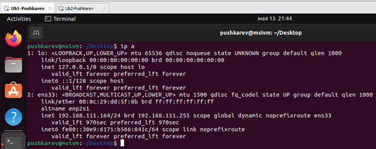
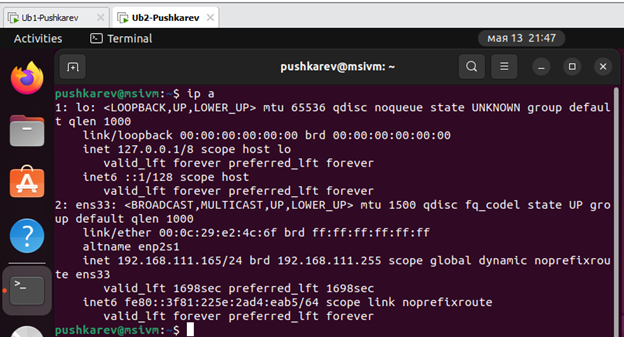
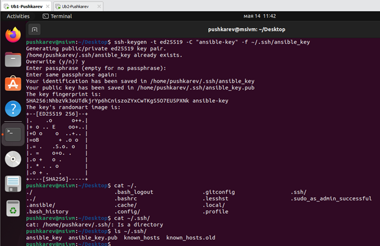
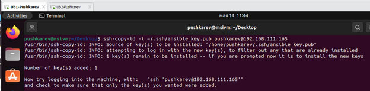
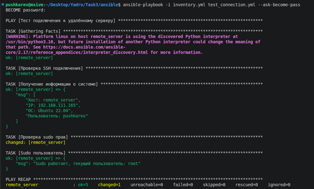
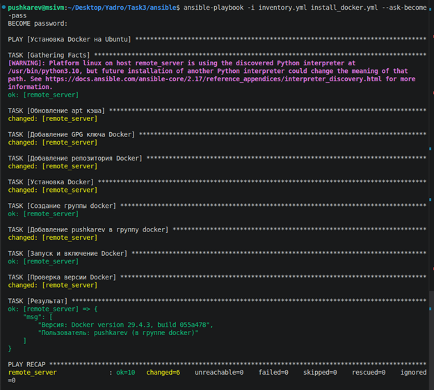
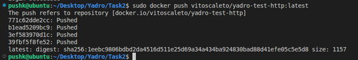
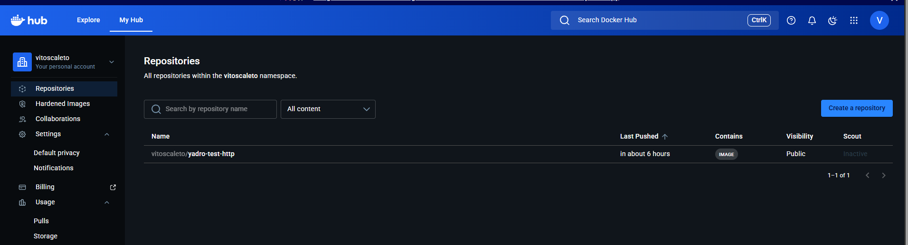
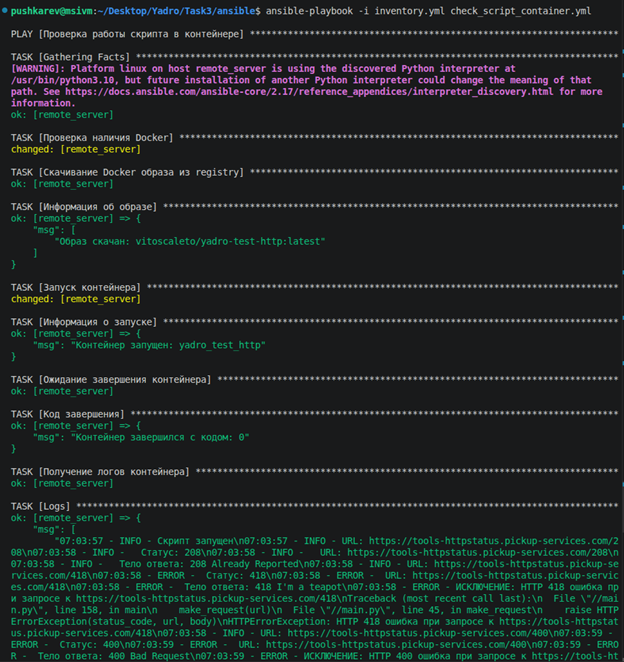

# Пошаговая автоматизация с использованием Bash/Python, Docker и Ansible

## Раздел 1
Была разработана программа на Python, которая выполняет  HTTP-запросы к сервису https://tools-httpstatus.pickup-services.com/ и обрабатывает ответы по ТЗ. 
При вызове скрипта рандомно выбираются 5 запросов из списка. 

## Раздел 2 
Был разработан Docker-образ на базе Ubuntu 22.04. Код был скопирован в последнюю очередь, чтобы избежать пересборки слоев при изменении кода.

## Раздел 3

Автоматизация с помощью Ansible производилась на двух ВМ на базе VMware® Workstation 17 Pro. Было использовано две машины Ub1-Pushkarev(Controle Node) и конфигурируемая ВМ Ub2-Pushkarev(Target Node) с адресами 192.168.111.164(рис.1) и 192.168.111.165(рис.2).

*Рисунок 1 - Controle Node Ub1*

*Рисунок 2 - Target Node Ub2*

### SSH
Для безопасного подключения было выполено создание ключей ansible-key. Публичный ключ был склонирован на таргет нод (рис. 3-4). 

*Рисунок 3 - SSH-keygen*

*Рисунок 4 - SSH-copy*

### Ansible
1. Был создан файл inventory.yml с указанием адреса вм машины. Для тестирования подключения написан плейбук test_connection.yml с проверкой подключения под sudo. Плейбук был запущен с параметром --ask-become-pass запрашивает sudo пароль перед выполнением задач, требующих повышенных привилегий. Выполенения плейбука (рис. 5)

*Рисунок 5 - test_connection.yml*

2. Был написан плейбук install_docker.yml для установки докера на вм. Выполнения плейбука (рис. 6)

*Рисунок 6 - install_docker.yml*

3. Созданный образ из пункта 2 был выгружен в Docker hub (рис. 7-8).

*Рисунок 7- Docker push*

*Рисунок 8 - Docker hub*

4. Был создан плейбук check_script_container.yml, который проверяет наличие докера, скачивает образ с облачного хранилища, запуска конейнер и выводит логи контейнера, проверяет код завершения (рис. 9). 

*Рисунок 9 - check_script_container.yml*